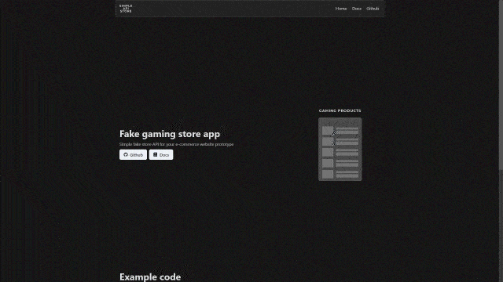
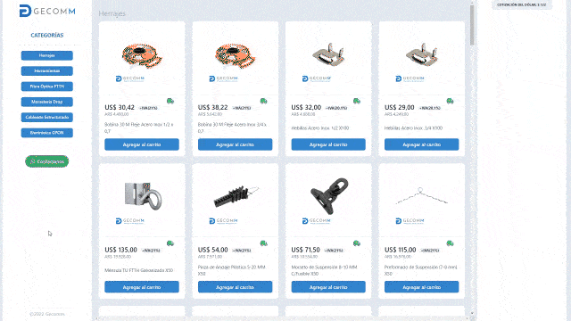
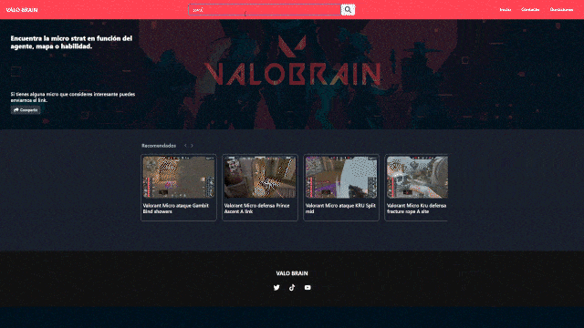
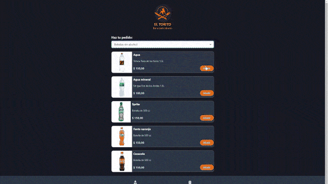

  
  
  

- 💻 I’m currently working as frontend developer at [Inceptia](https://www.inceptia.ai/).

- ❤️ I love writing TypeScript, and building fun experiments on type-level.

- 🌱 I believe in form good habits that lead to remarkable results. No matter your goals, with a correct planification and good habits is only a matter of time.
- 🕹 With a background in Math, Physics, and Statistics.

See [my website](https://pabloramos.vercel.app) for more information!

<h1 align="center">Projects</h1>
<table bordercolor="#66b2b2">
  
  <tr>
    <td width="50%" valign="top">
      <h3 align="center">Simple API store</h3>
         
        
         
        

          
    
  
      

        
<strong>Typecript, Next.js, Chakra-UI,</strong> - API that can provide an array of 30 products or an object with a single product. Useful for e-commerce prototypes.

    </td>
    <td width="50%" valign="top">
      <h3 align="center">Gecomm</h3>
         
      
         
        

          
  
  
      

        
<strong>Javascript, Next.js, Chakra-UI</strong> - Zero cost e-commerce app, since it has a database of products and sales made in Google Sheets.

    </td>
  </tr>
  
  <tr>
    <td width="50%" valign="top">
      <h3 align="center">Valobrain</h3>
       
        
       
        

  
  
      

        
<strong>Javascript, Next.js, Chakra-UI</strong> - Gaming app for Valorant which consists in a video search engine from a specific YouTube channel.

    </td>
    <td width="50%" valign="top">
      <h3 align="center">El torito bar</h3>
         
        
         
        

          
  
  
      

        
<strong>Typescript, Next.js, Chakra-UI</strong> - App with mobile design for a restaurant with a digital menu where you can make orders.

    </td>
  </tr>
</table>

<h1 align="center">Technologies</h1>

    
    
    
    
    
    
    
    
    
    
    
    
    
    
    
    
    

<h1 align="center">GitHub Stats</h1>

  
  

---

<h1 align="center">Connect</h1>

  
  
  

